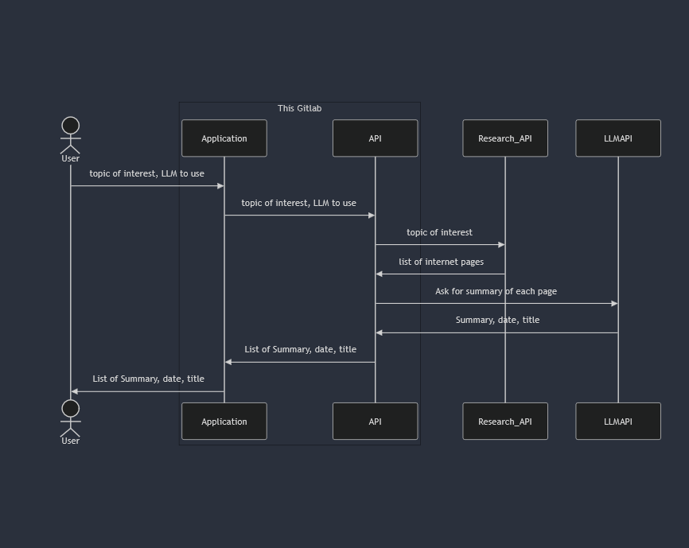

# LLM-enhanced research

## Objective

The objective of this project is to create an LLM-enhanced web search.

To a given user query, the application first looks online for articles on the topic and then summarizes them with an LLM in order to help the user have clear, concise and reliable information.



## Content of the repository

This repository contains two main elements :
- app : an application that contains the frontend and orchestrates actions in order to do our research.
- api : an api that handles asking questions to our LLM as well as looking online for information to do our research.

## Run the application

### Global variables

In order to run the project, you will need to add a .env file to the app folder and the api folder. The file should contain the following variables :

For the app :
- API_BASE_URL (the base url to call to get your LLM answer. If you run the application locally, the base url should be http://127.0.0.1:8000).
- API_KEY (the application uses an API_KEY to check users)

For the api :
#### LLM API
- OPENAI_KEY (API key for openai). Optional if you plan to use another llm.
- MISTRAL_KEY (API key for mistral). Optional if you plan to use another llm.
- AOAI_KEY (API key for azure openai). Optional if you plan to use another llm.
- AOAI_ENDPOINT (endpoint for azure openai). Optional if you plan to use another llm.
- AOAI_DEPLOYMENT_ID (deployment ID for azure openai). Optional if you plan to use another llm.
- AOAI_API_VERSION (API version for azure openai). Optional if you plan to use another llm.
- MAX_LLM_INPUT_SIZE (Requests to llms that are too long may cause problems. We set a limit to the max len of requests to LLMs)
#### Authentication
- HASHED_API_KEY (Hashed version of this present API_KEY in order to check the user api key)
#### Information apis
- NEWSAPI_KEY (key to use newsapi for the information retrieval phase)
- SERPAPI_KEY (key to use serpapi for the information retrieval phase)

### In python

Open two terminals (one for the api and one for the app).

With the first terminal, go to the api folder and run the following command:

```bash
uv -q venv --seed
uv -q sync --frozen
uv run src/article_retriever/main.py
```

With the second terminal, go to the app folder and run the following command:

```bash
uv -q venv --seed
uv -q sync --frozen
uv run streamlit run src/veille_assistant/main.py
```

### Tests

In order to launch tests, go to the directory api (to launch api tests) or app (to launch app tests) and run the command :
```bash
uv run pytest src/path to test files/
```

## Image credits

Looking glass icon image : <a href="https://www.flaticon.com/free-icons/research" title="research icons">Research icons created by ibrandify - Flaticon</a>

Thanks to all!

## Contribute

The following features need to be implemented
- Parallelize LLM requests in API
- Support more models in API
- Authentication in the App
- Tests with more search APIs
